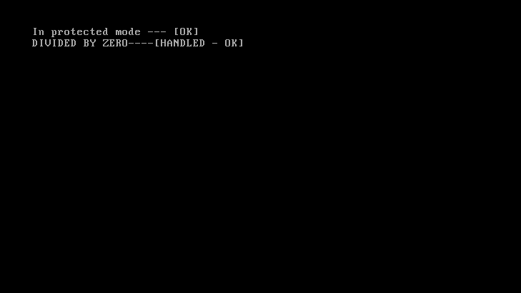

# riseros_

<!--  -->

<!--  -->

> Test command - ./core/qemu-system-i386 -cdrom build/os.iso

[Everything is documented here! 🔗](https://chauhansumitdev.github.io/riser-OS/)

## Updates
<table>
<tr>
    <td>
      
      
28 Dec 2024

    </td>
  </tr>
  <tr>
    <td>
      
      
13 Dec 2024

    </td>
    <td>
      
      
15 Nov 2024

    </td>
    <td>
      
      
12 Nov 2024

    </td>
  </tr>
</table>

