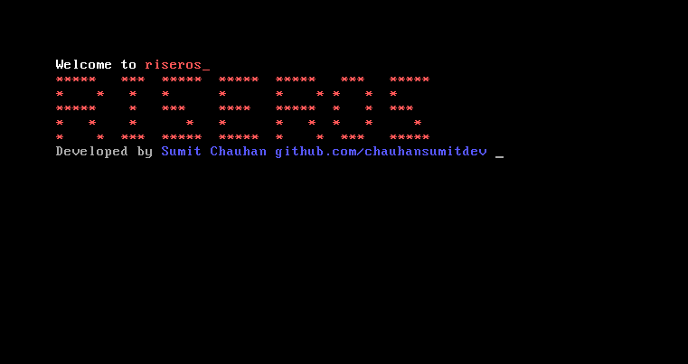
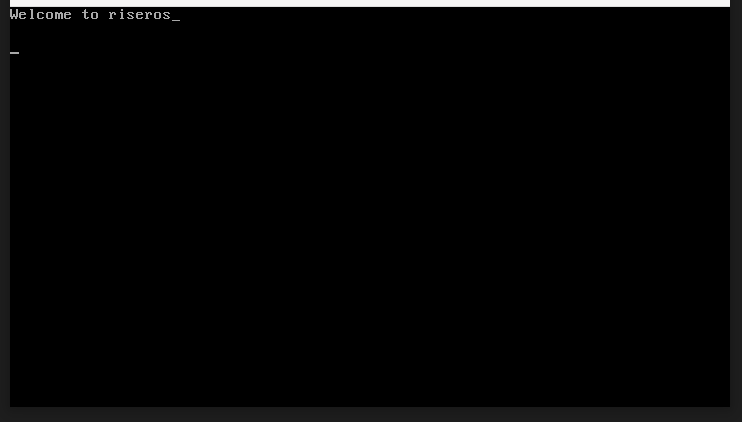

# RiserOS

<!--  -->

<!--  -->

> Test command - qemu-system-i386 -cdrom build/os.iso

[Everything is documented here! 🔗](https://chauhansumitdev.github.io/riser-OS/)

## updates_

### 13 Dec 2024
- Global co-ordinates for cursor : cursor_row , cursor_col, etc.
- println(const char *str) implemented.
- [TODO] Line wrap
- Decoupled code.

### 15 Nov 2024

### 12 Nov 2024

